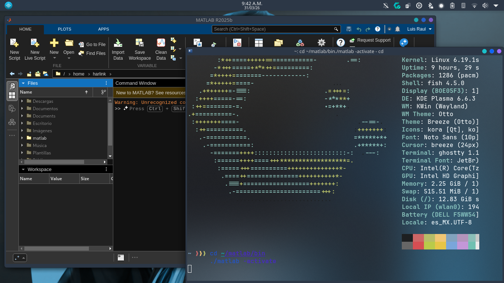

# 🚀 MATLAB R2025b en Arch Linux / CachyOS (Native Distrobox Hack)

Instalar MATLAB en distribuciones *rolling release* modernas como CachyOS o Arch Linux suele terminar en un infierno de errores (específicamente `Segmentation violation` en `lc_new_job` o `Transport stopped`). 

Este repositorio contiene un script automatizado que resuelve la incompatibilidad de raíz utilizando un "Caballo de Troya" mediante contenedores, para finalmente dejar MATLAB corriendo de forma **100% nativa** aprovechando toda la RAM y CPU sin emulaciones.

## 🧠 ¿Por qué falla MATLAB en Arch Linux?
El instalador y el administrador de licencias (FlexNet) de MathWorks R2025b están compilados para ecosistemas más conservadores (como Ubuntu 22.04/24.04). Al intentar leer la huella digital de tu hardware para la licencia en un sistema con `glibc` muy reciente o interfaces de red modernas (sin `eth0`), el programa entra en pánico y se estrella (crash) antes de poder mostrar la ventana gráfica.

## 💡 La Solución: El Caballo de Troya
En lugar de "parchar" binarios internos de MATLAB que se rompen con cada actualización, este método hace lo siguiente:
1. Descarga los binarios puros usando `mpm` (MathWorks Package Manager).
2. Crea un contenedor invisible con **Ubuntu 24.04** usando `distrobox`.
3. Ejecuta el activador de MATLAB *dentro* de la caja de Ubuntu para que detecte las librerías antiguas y genere tu archivo de licencia válido en tu `/home`.
4. **Destruye el contenedor** para recuperar espacio.
5. Ejecuta MATLAB nativamente desde Arch Linux (al ya tener el archivo de licencia en el `/home`, MATLAB se salta la verificación de hardware problemática).

## 🛠️ Requisitos
- CachyOS o Arch Linux.
- Cuenta institucional o licencia válida de MathWorks.
- Conexión a internet.

## 🚀 Uso Rápido
Clona este repositorio, dale permisos de ejecución al script y córrelo. 

\`\`\`bash
git clone https://github.com/TU_USUARIO/matlab-arch-native.git
cd matlab-arch-native
chmod +x install_matlab_arch.sh
./install_matlab_arch.sh
\`\`\`
*Nota: Durante el proceso, el script pausará y te abrirá la ventana gráfica azul de MATLAB. Inicia sesión con tu cuenta, activa el producto y luego cierra la ventana para que el script pueda continuar con la limpieza.*

## 📦 Cómo instalar Toolboxes adicionales después
Si en el futuro necesitas agregar paquetes (por ejemplo, soporte para hardware RTL-SDR o Machine Learning), no uses el gestor gráfico de Add-Ons, ya que invoca el mismo instalador obsoleto. 

Usa `mpm` directamente desde la terminal de forma segura:
\`\`\`bash
cd ~/Downloads
./mpm install --release=R2025b --destination=$HOME/matlab --products Aerospace_Toolbox
\`\`\`

---
*Documentado a las 8:00 AM tras una épica noche de troubleshooting y debugging de señales. xD*
